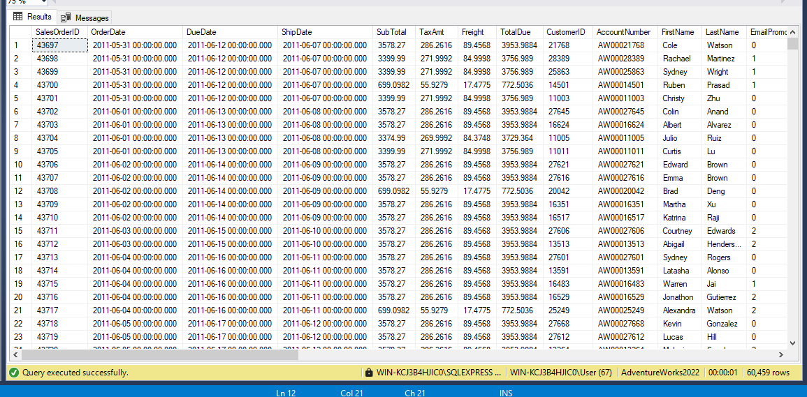

# Adventure Works 2022 Sales Dashboard

## Project Overview

This project involves building a comprehensive **Power BI dashboard** using the **AdventureWorks2022** dataset. The dashboard provides insights into total sales, customer distribution, and sales prediction using a **linear regression model** for **TotalDue** prediction.




## Features

1. **Dashboard Visuals**:
    - **Total Sales by Territory**: A bar chart displaying sales across different territories.
    - **Sales by City**: A map showcasing sales distribution across global cities.
    - **Total Sales by Date**: A line chart visualizing sales over time.
    - **Sales by Customer Region**: A pie chart breaking down sales by customer region.
    - **Customer Sales Distribution**: A donut chart showing the distribution of customer sales by territory.
    - **Customer Sales Distribution Over Time**: A line chart highlighting customer sales trends.
    - **Product Quantity Sold by Product**: A donut chart displaying the quantity of products sold.
    - **Top 10 Sold Products**: A bar chart listing the top 10 most sold products.

2. **Machine Learning**:
    - A **linear regression model** was built using **Python** to predict **TotalDue** values based on historical data from the AdventureWorks dataset.
    - The key features used for prediction include product sales, order quantities, and customer data.

## Technology Stack

- **Power BI**: For data visualization and dashboard creation.
- **SQL Server**: To query and prepare data from the AdventureWorks2022 database.
- **Python**: For the development of the regression model.
- **Libraries Used**:
  - `pandas`: For data manipulation.
  - `sklearn`: For model building and evaluation.

## Files

- **SQL Queries**: Used to extract and prepare the data from AdventureWorks2022.
- **Python Script**: The script provided for building the linear regression model.
- **Power BI Dashboard**: The final visualization showing sales insights and predictions.

## Data Preparation

Tables from the **AdventureWorks2022** database were connected using SQL, and essential fields were extracted to build the Power BI dashboard. The main tables used include:
- Sales
- Customer
- Products

## Machine Learning Model

The linear regression model predicts the **TotalDue** for various orders. The model is built using **sklearn**'s `LinearRegression` and has been trained on numerical fields extracted from the dataset. Here's the key part of the code used to develop the model:

```python
import pandas as pd
from sklearn.model_selection import train_test_split
from sklearn.linear_model import LinearRegression
from sklearn.metrics import mean_squared_error

# Load the dataset
data = pd.read_csv('Exams.csv')

# Selecting features for the model
X = data.select_dtypes('number').drop(columns=['SubTotal', 'TaxAmt', 'Freight', 'TotalDue'])
y = data['TotalDue']

# Train-test split
X_train, X_test, y_train, y_test = train_test_split(X, y, test_size=0.3, random_state=42)

# Training the linear regression model
model = LinearRegression()
model.fit(X_train, y_train)

# Making predictions
y_pred = model.predict(X_test)

# Evaluating the model
rmse_new = mean_squared_error(y_test, y_pred, squared=False)
print(f"RMSE: {rmse_new}")

# Adding predictions to the dataset
data['Predicted_TotalDue'] = model.predict(X)

# Mean comparison
print(f"Predicted Mean: {y_pred.mean()}")
print(f"Actual Mean: {y.mean()}")
```

### Model Evaluation:
- **RMSE**: The Root Mean Squared Error of the model on the test set is printed in the script.
- The mean comparison between the predicted and actual **TotalDue** is also included to assess model accuracy.

## How to Run

1. **Power BI Dashboard**: Open the Power BI file and refresh the data to update the visualizations.
2. **Python Script**: Run the Python script provided to train and test the regression model on your local machine.

## Future Improvements

- Enhance the model by exploring more advanced algorithms like **Random Forest** or **Gradient Boosting**.
- Integrate real-time data for up-to-date sales predictions.
- Add more detailed customer segmentation and analysis for better insights.
